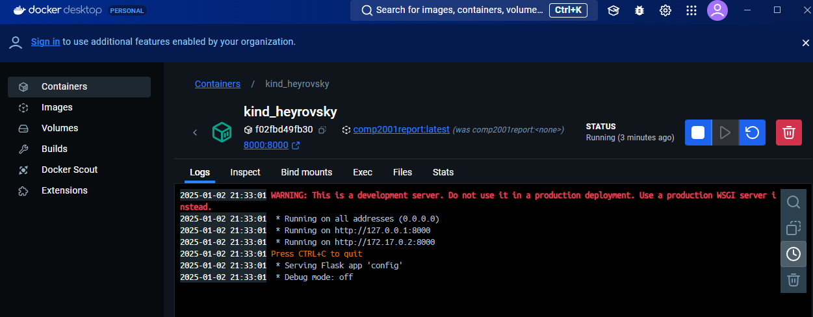
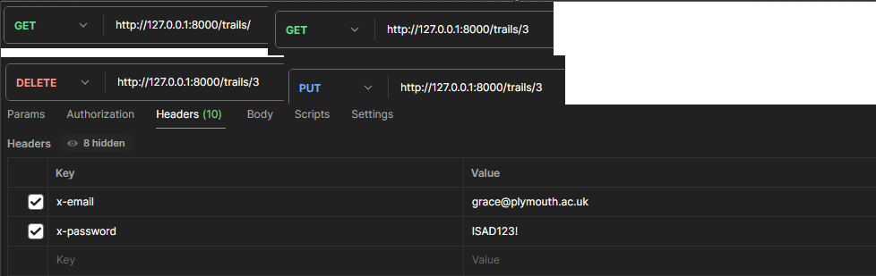
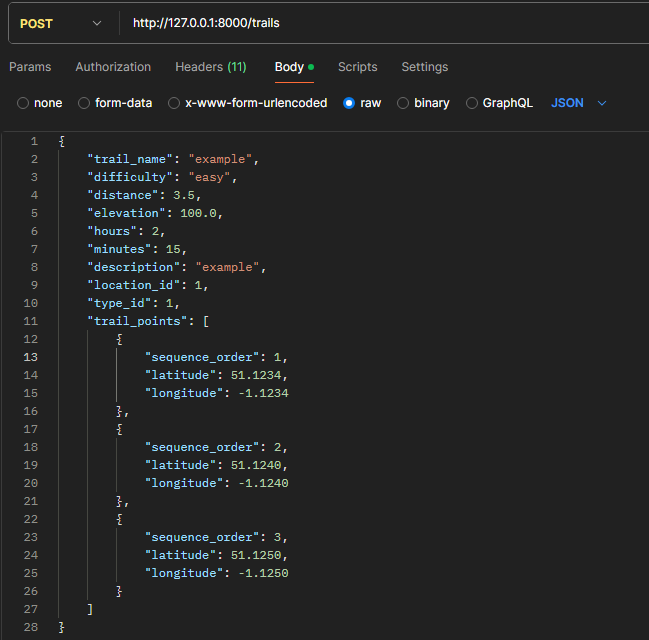

# Comp2001-CW2 Trail API

## GitHub Repository

[GitHub Repo](https://github.com/zacvenus/Comp2001-CW2)

This application uses swagger and flask to allow the user to interact with an sql database to perform actions on the trail data within the db through the swagger ui.

## installation

Software needed:
   - [FortiClient](https://www.fortinet.com/products/endpoint-security/forticlient) to connect to the database.  
   - [Docker](https://www.docker.com/) to build and run the Docker image.
   - [Postman Agent](https://www.postman.com/downloads/) to make header requests to the API.  
   - Your choice of IDE for example powershell or Visual studio to read the code or run terminal commands
   - The actual application from the repo

Steps:
1) install prerequisites as previously declared.
2) Log into the forticlient Vpn with your credentials.
3) in the terminal if testing locally "cd" into the path the file is located however as u are using docker this will be done for you.
4) run these commands 
    - docker build -t comp2001report .
    - docker run -d -p 8000:8000 comp2001report
5) This should build ur docker image and run it which should be visible on ur docker app.
   if it outs an error about the port being in use make sure the port is empty and try again.
6) Now when you access your docker app there should be a new image and container clicking on the container it should prompt you with something like this:

 Opening the first link will bring you to the swagger ui.
 7) You may now interact with the API however some action are limited by autherisation, this is where postman agent comes in.
 8) Using the Postman agent you can test on local urls through the postman website, Assuming you are already logged in you will copy 
    the url you are accessing the API with, Select the appropriate action you wish to perform, Providing data in format if needed 
    and Authorised credentials in the headers of your request.
    
    
9) You can now access the azure data base to check if your changes have been applied correctly under the COMP2001_ZVENUS database.

Here is the example json in text form:

{
    "trail_name": "example",
    "difficulty": "easy",
    "distance": 3.5,
    "elevation": 100.0,
    "hours": 2,
    "minutes": 15,
    "description": "example",
    "location_id": 1,
    "type_id": 1,
    "trail_points": [
        {
            "sequence_order": 1,
            "latitude": 51.1234,
            "longitude": -1.1234
        },
        {
            "sequence_order": 2,
            "latitude": 51.1240,
            "longitude": -1.1240
        },
        {
            "sequence_order": 3,
            "latitude": 51.1250,
            "longitude": -1.1250
        }
    ]
}

## issues
There is only one known issue that due to use of openapi3.0 and flask when a menu is opened on the swagger ui it prompts an error message due to legacy definitions in the swagger code itself, this does not effect the use of the code however i could not find how to remove the error itself.